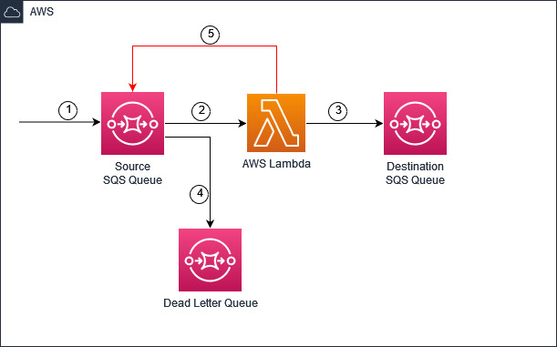

# AWS Lambda Recursion Controls Sample

This is a sample application to demonstrate preventitive controls to detect recursion in AWS Lambda functions.
You can find more details about this feature in this [blog post](https://aws.amazon.com/blogs/compute/detecting-and-stopping-recursive-loops-in-aws-lambda-functions/).

The sample application is a simple order processing app with following architecture.

1. A new order information message is sent to the source SQS queue.
2. This message is consumed by a Lambda function from the source queue using the Event Source Mapping
3. The Lambda function processes the message and sends the updated orders message to the destination SQS queue using SQS SendMessage API.
4. A Dead Letter Queue(DLQ) is configured for handling any failed or unprocessed messages. 
5. Because of a mis-configuration, the Lambda function sends the message to the source SQS queue instead of the destination queue. This will cause an unintended recursive loop of Lambda function executions. 

### Deployment

#### Pre-requisites
1. AWS Account
2. [AWS CLI](https://docs.aws.amazon.com/cli/latest/userguide/getting-started-install.html)
3. AWS [SAM CLI](https://docs.aws.amazon.com/serverless-application-model/latest/developerguide/install-sam-cli.html) v1.82.0
4. [Docker](https://docs.aws.amazon.com/serverless-application-model/latest/developerguide/install-docker.html#install-docker-instructions)

#### CLI Commands

1.	Clone the git repository and change to project directory

	$ git clone https://github.com/aws-samples/aws-lambda-recursion-detection-sample

2.	Use the AWS SAM CLI to build the application

    $ sam build --use-container

3.	Use the AWS SAM CLI to deploy the resources to your AWS account.

    $ sam deploy --guided

This will deploy your Lambda function with source and target SQS queues.

Please note down the Source SQS Queue URL after deployment

### Test

	$ aws sqs send-message --queue-url <SOURCE_SQS_URL> --message-body '{\"orderId\":"1",\"productName\":\"Bolt\",\"orderStatus\":\"Submitted\"}'

### Cleanup
    $ sam delete

## Security

See [CONTRIBUTING](CONTRIBUTING.md#security-issue-notifications) for more information.

## License

This library is licensed under the MIT-0 License. See the LICENSE file.